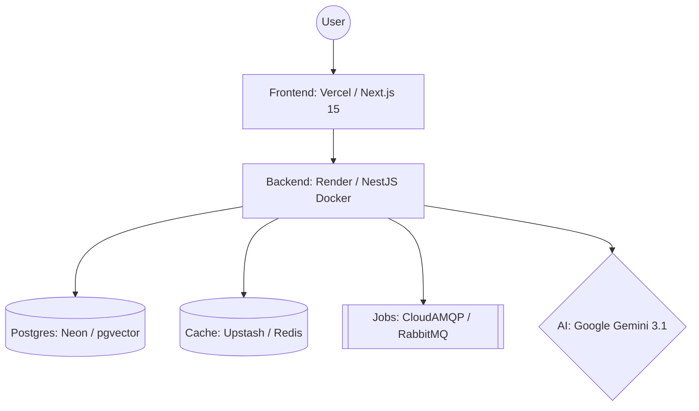

# SkillBridge — Peer-to-Peer Skill Exchange Platform

SkillBridge is a modern, AI-powered web application designed for people to trade skills directly. Teach someone what you know, and learn something new in return.

---

## ✨ Features

- **AI-Powered Matching:** Uses Gemini Embeddings to find the best skill partners based on semantic similarity.
- **Smart Agendas:** Generates custom 1-hour session agendas using Gemini 3.1 Flash.
- **Real-time Collaboration:** Instant messaging and session status updates via WebSockets.
- **Secure Auth:** JWT-based local authentication + Google OAuth 2.0 integration.
- **Reputation System:** Skill-specific reviews and user trust scores.

---

## 🏗️ Production Architecture



---

## 🚀 Quick Start (Local Development)

### Prerequisites
- **Docker Desktop**
- **Node.js 20+**

### Step-by-Step Setup
1. **Clone & Install:**
   ```bash
   npm install && cd skillbridge-backend && npm install && cd ../skillbridge-frontend && npm install
   ```

2. **Backend Setup:**
   ```bash
   cd skillbridge-backend
   cp .env.example .env
   docker compose up -d
   make db:migrate
   npm run dev
   ```

3. **Frontend Setup:**
   ```bash
   cd skillbridge-frontend
   npm run dev
   ```

---

## 🛠️ Deployment Guide

### 1. Cloud Infrastructure
We use a high-performance, cost-effective stack:
- **Database:** [Neon](https://neon.tech/) (Singapore) — Serverless Postgres with `pgvector`.
- **Cache:** [Upstash](https://upstash.com/) (Singapore) — Serverless Redis for Socket.io.
- **Queue:** [CloudAMQP](https://www.cloudamqp.com/) (Singapore) — RabbitMQ for background tasks.
- **AI:** [Google AI Studio](https://aistudio.google.com/) — Gemini 3.1 Flash-Lite.
- **Hosting:** [Render](https://render.com/) (Backend) & [Vercel](https://vercel.com/) (Frontend).

### 2. Environment Variables Checklist

#### Backend (Render Dashboard)
- `DATABASE_URL`: Your Neon connection string (Pooled).
- `REDIS_URL`: Your Upstash URL (`redis://...`).
- `RABBITMQ_URL`: Your CloudAMQP URL.
- `JWT_SECRET` / `JWT_REFRESH_SECRET`: Secure 64-char strings.
- `GOOGLE_CLIENT_ID` / `SECRET`: From Google Cloud Console.
- `GOOGLE_CALLBACK_URL`: `https://your-api.onrender.com/auth/google/callback`
- `FRONTEND_URL`: `https://your-app.vercel.app`
- `GEMINI_API_KEY`: From Google AI Studio.

#### Frontend (Vercel Dashboard)
- `NEXT_PUBLIC_API_URL`: `https://your-api.onrender.com`
- `NEXT_PUBLIC_GRAPHQL_ENDPOINT`: `https://your-api.onrender.com/graphql`
- `NEXT_PUBLIC_GRAPHQL_WS_ENDPOINT`: `wss://your-api.onrender.com/graphql`

---

## 🤝 CI/CD & Maintenance

- **Health Checks:** Monitor `https://your-api.onrender.com/health` via Cron-Job.org to prevent sleep.
- **Automated Tests:** GitHub Actions runs linting and build checks on every push to `main`.
- **Migrations:** Handled automatically on deployment via Render's startup command.
